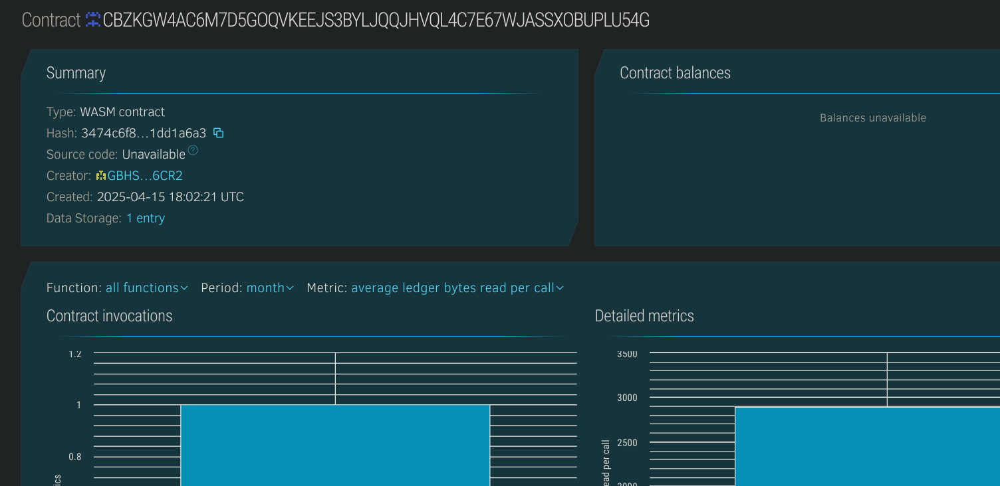

# basic-dao-voting-system

## 📌 Project Title
**basic-dao-voting-system**

## 📄 Project Description
This Soroban smart contract implements a minimal decentralized autonomous organization (DAO) voting mechanism where users can create proposals, cast votes, and close proposals. It is intended as a learning project for understanding DAO governance logic on the Stellar blockchain using Soroban SDK.

## 🎯 Project Vision
To provide developers and learners a simplified foundation for DAO-based governance systems by showcasing how proposals are created, voted upon, and finalized in a decentralized, transparent, and trustless manner using smart contracts.

## 🌟 Key Features
- 🗳 Create a proposal with a unique ID and description.
- ✅ Cast votes either in favor or against active proposals.
- 🔒 Close proposals after voting ends to prevent further changes.
- 🔍 Query proposal details including vote count and status.

## 🚀 Future Scope
- Add user-based vote tracking to prevent double voting.
- Include voting weight based on token holdings.
- Implement quorum and proposal outcome logic.
- Support for proposal expiry and time-bound voting.
- DAO governance upgrade with role-based permissions.

## Contract Details:
CBZKGW4AC6M7D5GOQVKEEJS3BYLJQQJHVQL4C7E67WJASSXOBUPLU54G

